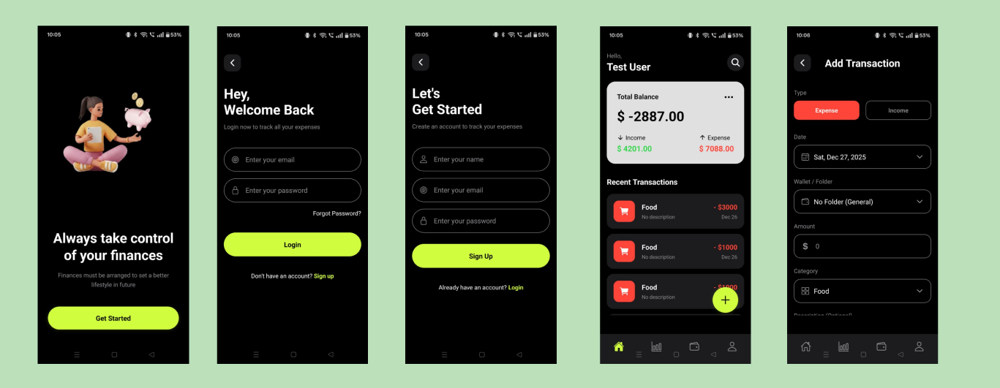
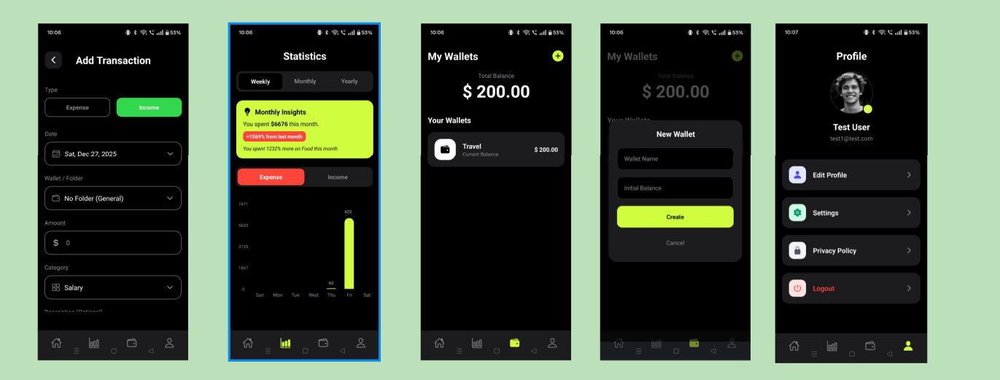

# PocketExpense+ — Smart Expense Tracker

PocketExpense+ is a full-stack mobile application designed to help users track their spending, visualize financial habits, and set monthly budgets. Unlike simple trackers, it offers smart insights, folder-based organization (Wallets), and works offline.

## 📸 Screenshots & Demo

### Authentication & Onboarding



**Screens**: Splash Screen → Login → Signup

### Main Features



**Screens**: Dashboard with Total Balance → Add Transaction → Weekly/Monthly Stats → Wallets Management → User Profile

## 🎥 App Demo Video

[Pocket-expense Demo Video](https://drive.google.com/drive/folders/1-kJveuXTjIyGIIipepLxWGzeRIeP9WVZ?usp=sharing)

## Features

### Core Features

- **User Authentication**: Secure Login & Signup using JWT
- **Expense Tracking**: Add Income and Expenses with categories, dates, and descriptions
- **Dashboard**: Real-time calculation of Total Balance, Income, and Expenses
- **Smart Stats**: Interactive Bar Charts for Weekly, Monthly, and Yearly spending trends
- **Wallets (Folders)**: Organize transactions into specific accounts (e.g., "Travel Fund", "Salary")
- **Search**: Instantly filter transactions by category or description

### Bonus & Advanced Features

- **Monthly Budget Limits**: Set a spending limit in your profile. The app alerts you if a new transaction will exceed your budget
- **Smart Insights**: A dynamic card that tells you spending trends (e.g., "You spent 20% more than last month")
- **Offline Handling**: The app detects network status and safely prevents data loss by restricting actions when offline
- **Edit & Delete**: Full control to modify or remove past transactions

## 🛠️ Tech Stack

- **Frontend**: React Native (Expo), TypeScript, React Native Gifted Charts, React Native Reanimated
- **Backend**: Node.js, Express.js
- **Database**: MongoDB (Mongoose)
- **Authentication**: JSON Web Tokens (JWT)
- **Tools**: Axios, Async Storage, NetInfo (for offline checks)

## ⚙️ Installation & Setup

Follow these steps to run the project locally.

### 1. Prerequisites

- Node.js installed
- MongoDB installed locally or a MongoDB Atlas connection string
- Expo Go app on your phone (or Android Emulator)

### 2. Backend Setup

Navigate to the backend folder and install dependencies:

```bash
cd backend
npm install
```

Create a `.env` file in the backend folder (or use the provided `.env.example`):

```
PORT=3000
MONGO_URI=mongodb://localhost:27017/expense-tracker
JWT_SECRET=your_super_secret_key_123
```

Start the server:

```bash
node server.js
```

Server runs on `http://localhost:3000`

### 3. Frontend Setup

Navigate to the app folder:

```bash
cd expense-app
npm install
```

**Important**: Update the API URL.

Open `services/api.ts` and replace localhost with your computer's IP address:

```typescript
// Example
const BASE_URL = "http://192.168.1.10:3000/api";
```

Start the app:

```bash
npx expo start
```

Scan the QR code with the Expo Go app on your Android/iOS device.

## API Documentation

### Authentication

- `POST /api/auth/register` - Create a new user
- `POST /api/auth/login` - Login and receive JWT
- `PUT /api/auth/profile` - Update Name, Currency, or Monthly Budget Limit

### Expenses

- `GET /api/expenses` - Get all transactions for the logged-in user
- `POST /api/expenses` - Add a new transaction (Income/Expense)
- `GET /api/expenses/:id` - Get details of a specific transaction
- `PUT /api/expenses/:id` - Update a transaction
- `DELETE /api/expenses/:id` - Delete a transaction

### Statistics & Insights

- `GET /api/expenses/stats/insights` - Returns monthly spending comparison (e.g., +20% vs last month) and category highlights

### Wallets

- `GET /api/wallets` - Get all user wallets with calculated balances
- `POST /api/wallets` - Create a new wallet folder

## Offline Handling Strategy

To ensure data integrity, the app implements a "Detect & Protect" strategy:

- **Global Monitoring**: A generic OfflineNotice component monitors internet connectivity via NetInfo
- **Visual Cues**: A red banner appears at the top of the screen when connection is lost
- **Action Blocking**: Users are prevented from adding/editing data while offline to avoid sync conflicts and app crashes
- **Data Persistence**: Dashboard data is cached locally, allowing users to view their balance even without internet
